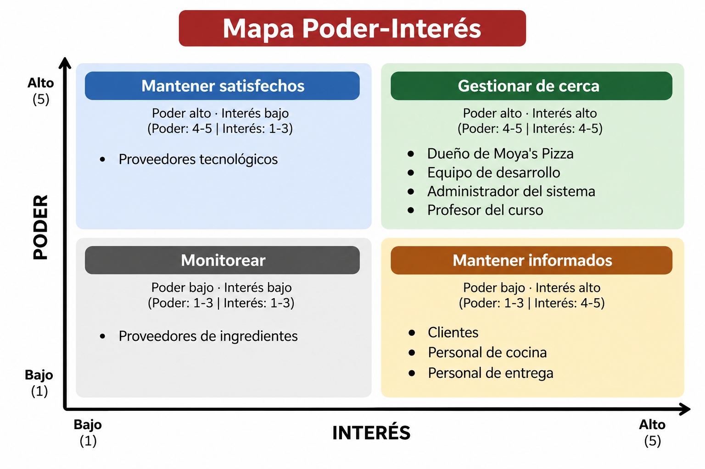

# Administración de Proyectos Informáticos

### ISW-912 · Ingeniería del Software

**Universidad Técnica Nacional**  
**Sede Regional de San Carlos**

**Profesor:** Deiver Cubero Molina  
**Estudiantes:** John Alejandro Araya Echeverría y Ryan Eliecer Vega Solano  
**Septiembre de 2026**

---

# Sistema web de catálogo y gestión de pedidos para Moya's Pizza

*Repositorio de entregables semanales del curso*

## Tabla de contenido

- [Semana 1: Planteamiento del proyecto](#semana-1-planteamiento-del-proyecto)
  - [Tema del proyecto](#11-tema-del-proyecto)
  - [Problema identificado](#12-problema-identificado)
  - [Proyecto propuesto](#13-proyecto-propuesto)
  - [Valor esperado](#14-valor-esperado)
  - [Indicadores de verificación](#15-indicadores-de-verificación)
  - [Objetivos](#16-objetivos)
- [Semana 2: Taller de interesados del proyecto](#semana-2-taller-de-interesados-del-proyecto)
  - [Identificación y registro de interesados](#21-identificación-y-registro-de-interesados)
  - [Justificación de las valoraciones](#22-justificación-de-las-valoraciones)
  - [Mapa Poder-Interés](#23-mapa-poder-interés)
  - [Tres interesados críticos](#24-tres-interesados-críticos)
  - [Enfoque de gestión del proyecto](#25-enfoque-de-gestión-del-proyecto)
- [Próximas semanas](#próximas-semanas)

---

## Semana 1: Planteamiento del proyecto

### 1.1 Tema del proyecto

**Sistema web de catálogo y gestión de pedidos para Moya's Pizza.**

### 1.2 Problema identificado

Moya's Pizza es una pizzería local que recibe pedidos únicamente mediante llamadas telefónicas y mensajes de WhatsApp. El dueño atiende estos canales mientras prepara las pizzas, lo que ocasiona los siguientes problemas:

- **Errores y pérdida de pedidos:** los pedidos se anotan en papel o se recuerdan de memoria, con posibles equivocaciones en tamaños, cantidades y precios.
- **Interrupciones en la cocina:** atender llamadas durante la preparación aumenta los tiempos de entrega y limita la cantidad de pedidos que pueden atenderse simultáneamente.
- **Ausencia de registros de ventas:** no es posible consultar cuánto se vendió en un día, identificar los productos más solicitados ni fundamentar decisiones sobre precios y promociones.
- **Información limitada para los clientes:** deben llamar para conocer el menú, los precios, las promociones y los tiempos de espera.

### 1.3 Proyecto propuesto

Se propone desarrollar e implementar un sitio web propio compuesto por tres elementos:

1. **Catálogo público:** permitirá consultar pizzas, combos, promociones, precios actualizados y descuentos vigentes.
2. **Proceso de pedido guiado:** permitirá crear un carrito, consultar un tiempo estimado de espera según la carga de la cocina, proporcionar datos de contacto y registrar el pedido directamente en la base de datos.
3. **Panel de administración:** ofrecerá al dueño acceso restringido para gestionar el menú, los precios, las promociones y los descuentos; recibir pedidos en tiempo real, actualizar su estado hasta la entrega y consultar el historial de ventas.

El sistema se plantea sobre servicios con planes gratuitos, por lo que el único costo recurrente previsto es la renovación anual del dominio. **No se procesarán pagos en línea:** el cliente indicará su método de pago y cancelará en el local o contra entrega.

### 1.4 Valor esperado

El proyecto busca reducir la carga de trabajo del dueño y proporcionarle información útil para administrar el negocio. Se esperan los siguientes beneficios:

- Reducir errores al permitir que cada cliente seleccione sus productos y que el sistema calcule el total con los precios vigentes.
- Aumentar la capacidad de atención al disminuir las interrupciones para contestar llamadas.
- Consultar las ventas por día o por rango de fechas.
- Dar autonomía al dueño para modificar precios, publicar promociones y cerrar temporalmente el negocio sin intervención técnica.
- Evitar costos operativos recurrentes adicionales y comisiones por pedido.

### 1.5 Indicadores de verificación

Para evaluar los resultados del proyecto se proponen estos indicadores:

| Indicador | Qué permitirá verificar |
| --- | --- |
| Porcentaje de pedidos recibidos por el sitio frente a llamadas | Adopción del canal digital. |
| Cantidad de pedidos con errores antes y después de implementar el sistema | Reducción de errores en la toma de pedidos. |
| Disponibilidad del historial diario de ventas | Acceso a información para la gestión del negocio. |

### 1.6 Objetivos

#### Objetivo general

Desarrollar e implementar un sistema web que permita a Moya's Pizza publicar su catálogo, recibir pedidos en línea y administrar su operación diaria, sin incorporar costos recurrentes al negocio.

#### Objetivos específicos (planteamiento inicial)

1. Analizar el proceso actual de toma de pedidos del negocio e identificar sus principales puntos de falla.
2. Definir los requerimientos funcionales y no funcionales del sistema junto con el cliente.
3. Diseñar la estructura de datos que soporte el catálogo, las promociones y el registro histórico de pedidos.
4. Desarrollar el sitio público y el panel de administración conforme a los requerimientos definidos.

---

## Semana 2: Taller de interesados del proyecto

### 2.1 Identificación y registro de interesados

Se identificaron **nueve interesados** relacionados con el proyecto. El poder y el interés se valoran de **1 (muy bajo) a 5 (muy alto)**. Las actitudes y puntuaciones son valoraciones iniciales para el taller.

| Interesado | Necesidad | Poder | Interés | Actitud | Estrategia |
|---|---|:---:|:---:|---|---|
| Dueño de Moya's Pizza | Administrar pedidos, productos, promociones y ventas. | 5 | 5 | Favorable | Gestionar de cerca. |
| Clientes | Consultar el menú y realizar pedidos fácilmente. | 3 | 5 | Favorable | Mantener informados. |
| Personal de cocina | Recibir pedidos claros y conocer los tiempos de preparación. | 3 | 5 | Favorable | Involucrar en pruebas. |
| Equipo de desarrollo | Contar con requerimientos claros y recursos suficientes. | 4 | 5 | Favorable | Gestionar de cerca. |
| Administrador del sistema | Gestionar el catálogo, los pedidos y las promociones. | 4 | 5 | Favorable | Gestionar de cerca. |
| Proveedores tecnológicos | Garantizar el uso adecuado de sus servicios. | 4 | 3 | Neutral | Mantener satisfechos. |
| Profesor del curso | Verificar el cumplimiento de los objetivos académicos. | 4 | 4 | Favorable | Gestionar de cerca. |
| Proveedores de ingredientes | Mantener la relación comercial con el negocio. | 2 | 2 | Neutral | Monitorear. |
| Personal de entrega | Recibir información correcta de los pedidos. | 2 | 4 | Favorable | Mantener informado. |

### 2.2 Justificación de las valoraciones

- **Dueño (5, 5):** autoriza las decisiones comerciales y tiene interés directo en mejorar la operación diaria.
- **Clientes (3, 5):** necesitan consultar información y hacer pedidos sin dificultades; influyen mediante sus comentarios, aunque no aprueban el proyecto.
- **Personal de cocina (3, 5):** el flujo de recepción de pedidos y los tiempos de preparación afectan directamente su trabajo.
- **Equipo de desarrollo (4, 5):** toma decisiones técnicas y ejecuta el proyecto, dentro del alcance acordado con el dueño.
- **Administrador del sistema (4, 5):** utiliza las funciones de gestión del catálogo, pedidos y promociones, por lo que tiene influencia operativa e interés elevado. Este rol podría ser desempeñado por el propio dueño.
- **Proveedores tecnológicos (4, 3):** las condiciones y límites de los servicios gratuitos pueden afectar la implementación, aunque no participan en las decisiones comerciales.
- **Profesor (4, 4):** supervisa los entregables académicos y evalúa el trabajo, sin dirigir el negocio.
- **Proveedores de ingredientes (2, 2):** mantienen una relación comercial con la pizzería, pero su participación en el desarrollo del sistema es limitada.
- **Personal de entrega (2, 4):** necesita datos correctos para las entregas, aunque tiene poca autoridad sobre el alcance del proyecto.

### 2.3 Mapa Poder-Interés

Se consideran **altos los valores 4 y 5** y **bajos los valores de 1 a 3**. El mapa corresponde a los nueve interesados del registro anterior.

| | **Interés bajo (1–3)** | **Interés alto (4–5)** |
|---|---|---|
| **Poder alto (4–5)** | **Mantener satisfechos:** proveedores tecnológicos (4, 3). | **Gestionar de cerca:** dueño de Moya's Pizza (5, 5); equipo de desarrollo (4, 5); administrador del sistema (4, 5); profesor del curso (4, 4). |
| **Poder bajo (1–3)** | **Monitorear:** proveedores de ingredientes (2, 2). | **Mantener informados:** clientes (3, 5); personal de cocina (3, 5); personal de entrega (2, 4). |

### 2.4 Tres interesados críticos

**1. Dueño de Moya's Pizza.** Tiene autoridad para aprobar las decisiones comerciales y conoce las necesidades del negocio. Se le involucrará mediante reuniones semanales, revisión de prototipos, demostraciones del sistema y validación de los entregables.

**2. Personal de cocina.** El sistema debe presentar pedidos claros y tiempos de preparación realistas. Se le involucrará mediante entrevistas sobre el proceso actual y pruebas del flujo de recepción y actualización de pedidos.

**3. Clientes.** Utilizarán el catálogo y el proceso de pedidos. Se les involucrará mediante encuestas breves y pruebas de usabilidad para evaluar la navegación, la claridad de precios y la facilidad para realizar pedidos.

### 2.5 Enfoque de gestión del proyecto

**Enfoque seleccionado: híbrido (predictivo y adaptativo).**

El componente **predictivo** se utilizará para establecer el alcance general, los entregables, los recursos y las restricciones conocidas desde el inicio. Entre ellas están el uso de servicios en sus planes gratuitos, el dominio como único costo recurrente previsto y la decisión de no procesar pagos en línea.

El componente **adaptativo** se utilizará para desarrollar y validar progresivamente el catálogo, el proceso de pedidos y el panel administrativo. Las revisiones con el dueño y las pruebas con usuarios permitirán ajustar la navegación, la presentación de la información y los flujos de trabajo conforme se identifiquen necesidades.

El enfoque híbrido permite conservar una planificación inicial y controlar las restricciones del proyecto, sin impedir ajustes basados en la retroalimentación de los interesados durante el desarrollo.

---

## Próximas semanas

Las siguientes entregas se incorporarán a este mismo README, con una sección independiente por semana y sus respectivos enlaces en la tabla de contenido.
